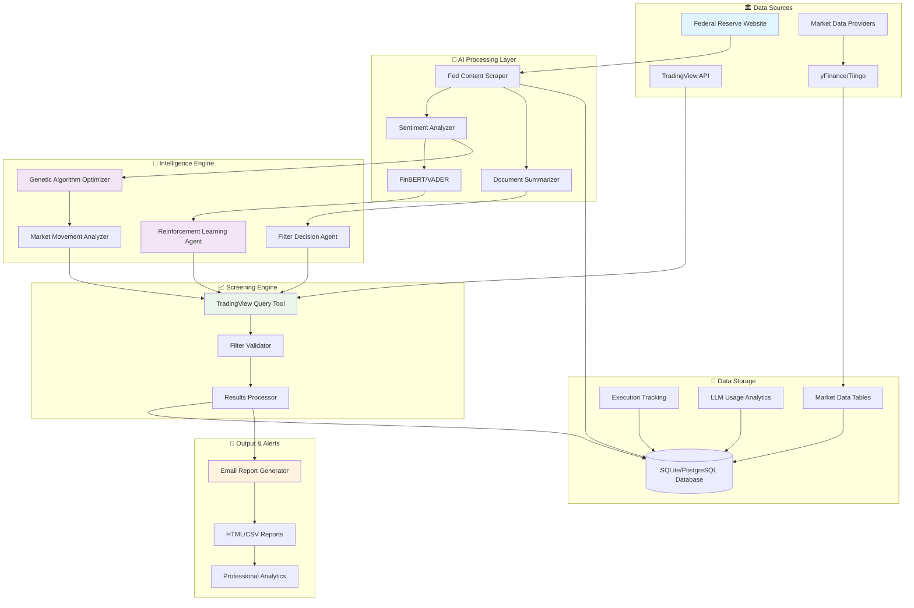
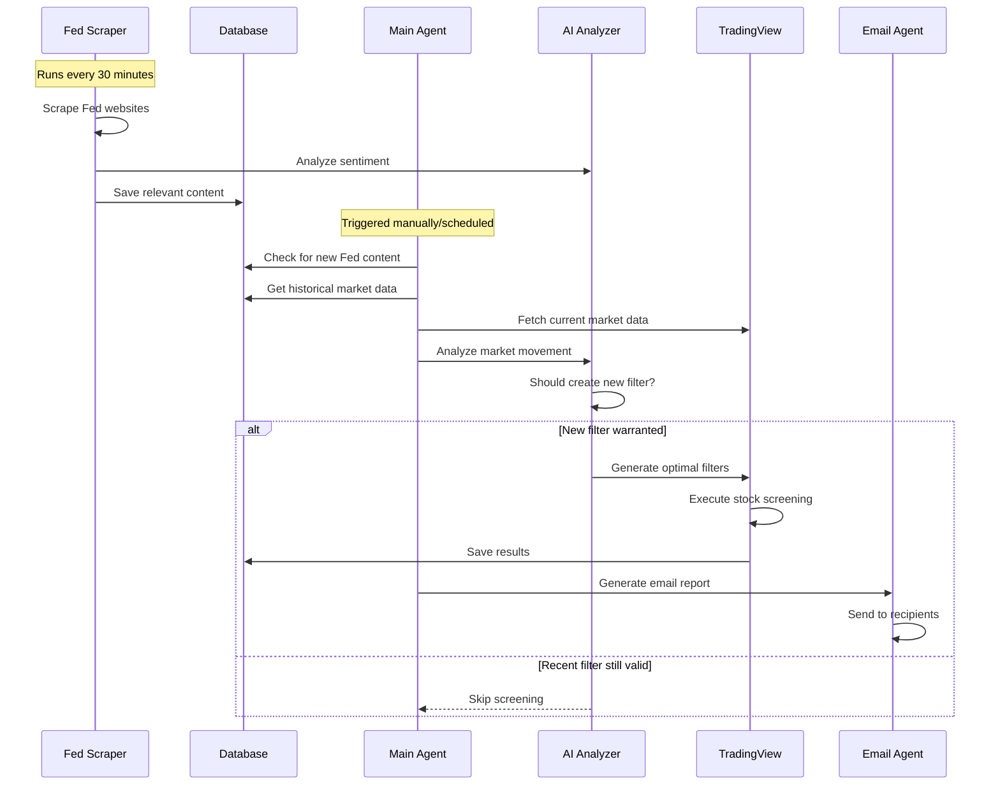

# 🚀 AI-Powered Federal Reserve Stock Screener

<div align="center">


**🎯 Intelligent stock screening powered by Federal Reserve analysis, genetic algorithms, and reinforcement learning**

*Transform Fed communications into actionable investment insights with cutting-edge AI*

[Installation](#-installation) • [Quick Start](#-quick-start) • [Architecture](#-system-architecture) • [Features](#-features) • [Demo](#-demo)

</div>

---
## ⚠️ Disclaimer


🚧 **This project is a personal interest and learning tool.**  
It is designed to experiment with AI-powered stock screening and financial data processing.

📊 The outputs, insights, or signals generated by this project are **not financial advice**, investment recommendations, or a substitute for professional judgment.

🙋‍♂️ Please conduct your own due diligence or consult a qualified financial professional before making any investment decisions.

🧪 This tool may contain bugs, limitations, or outdated data.  
Use it **at your own risk**.

## 🚧 Work in Progress 🚧

⚠️ This project is actively under development. Expect things to break occasionally — there is **no guarantee that the latest version is stable**.

🧪 I use version control to track progress and experiment with different features. Some commits may be incomplete or exploratory.

💻 This project is developed primarily on a **Windows machine**, so there may be platform-specific issues on macOS or Linux.

---
[Check out my Medium story about the stock screener](https://medium.com/@wintersweet001/customized-smart-stock-screener-built-in-less-than-4-hours-d112e80863d4)

💡 *This project is open source and shared for educational purposes only.*

## 📊 System Architecture



## 🌟 Key Features

### 🤖 **AI-Powered Analysis**
- **Federal Reserve Intelligence**: Real-time scraping and analysis of FOMC minutes, press releases, and speeches and RESEARCH Paper
- **Advanced NLP**: FinBERT and VADER sentiment analysis for financial content
- **Smart Summarization**: AI-generated summaries of complex Fed communications

### 🧬 **Genetic Algorithm Optimization** --- coming soon 
- **Evolving Filters**: GA-optimized TradingView screening criteria
- **Multi-Objective Fitness**: Precision, movement magnitude, timing accuracy, and diversification
- **Dynamic Adaptation**: Filters evolve based on market conditions and Fed policy changes

### 🎯 **Intelligent Screening**
- **Smart Filter Decisions**: AI determines when new screening is warranted
- **Market Movement Integration**: Real-time market data analysis combined with Fed signals
- **Quality Assurance**: Automatic filter validation and duplicate prevention

### 📊 **Automated Reporting**
- **Stylized HTML Reports**: With market analysis and link to raw data
- **CSV Exports**: Full data exports for further analysis
- **Execution Tracking**: Complete audit trail of all screening decisions

---

## 🛠️ Installation

### Prerequisites

Ensure you have Python 3.13+ installed:

```bash
python --version  # Should be 3.13+
```

### 1. Clone the Repository (master branch not main)

```bash
git clone https://github.com/winniepooh001/fed-signal-ai.git
```

### 2. Create Virtual Environment

```bash
# Create virtual environment
python -m venv .screener

# Activate virtual environment
# Windows:
.screener\Scripts\activate
# macOS/Linux:
source .screener/bin/activate
```

### 3. Install Dependencies

```bash
pip install -r requirements.txt
```

### 4. Environment Configuration

Create a `.env` file in the root directory:

```env
# LLM API Keys (choose one or more)
OPENAI_API_KEY=your_openai_api_key_here
GOOGLE_API_KEY=your_google_api_key_here
ANTHROPIC_API_KEY=your_anthropic_api_key_here
DEEPSEEK_API_KEY=your_deepseek_api_key_here

# Email Configuration (Gmail recommended)
SENDER_EMAIL=your_email@gmail.com
SENDER_PASSWORD=your_app_specific_password
RECIPIENT_EMAILS=recipient1@email.com,recipient2@email.com
SMTP_SERVER=smtp.gmail.com
SMTP_PORT=587
SENDER_NAME=AI Stock Screener

# Optional: Market Data API Keys
TIINGO_API_KEY=your_tiingo_api_key
ALPHA_VANTAGE_API_KEY=your_alpha_vantage_key

# Database Configuration (optional - defaults to SQLite)
DATABASE_URL=sqlite:///screener_data.db
```

### 5. Gmail App Password Setup

For email functionality, you'll need a Gmail App Password:

1. Enable 2-Factor Authentication on your Google Account
2. Go to [Google App Passwords](https://support.google.com/accounts/answer/185833)
3. Generate an app password for "Mail"
4. Use this password in your `.env` file (not your regular Gmail password)

### 6. Database Setup

```bash
# Initialize the database
python -c "from main import setup_database; setup_database()"
```

---

## 🚀 Quick Start

### 🔄 Two-Component System

This system runs two separate components that work together:

#### Component 1: Federal Reserve Data Scraper (Background Service)

I need to wrap this in a bat script and cd into the root folder. Otherwise this could break

```bash
# Run the Fed scraper (monitors Fed website for new content)
python scrapers/scraper_manager.py
```

**⚠️ Important**: Set up this as a scheduled task to run every 30 minutes during market hours:

**Windows Task Scheduler:**
```cmd
# Create task that runs:
python C:\path\to\ai-fed-screener\scrapers\scraper_manager.py
# Schedule: Every 30 minutes from 9:00 AM to 5:00 PM, Monday-Friday
```

**Linux/macOS Cron:**
```bash
# Add to crontab (crontab -e):
*/30 9-17 * * 1-5 /usr/bin/python3 /path/to/ai-fed-screener/scrapers/scraper_manager.py
```

#### Component 2: Main Screening Engine

```bash
# Run the main screening workflow
python main.py
```

This will:
1. 📊 Check for new Fed content
2. 🧠 Analyze market movements
3. 🤖 Make intelligent filtering decisions
4. 📈 Execute stock screens
5. 📧 Send email reports

---

## 📁 Project Structure

```
ai-fed-screener/
├── 🧠 agents/                    # AI agents and prompts
│   ├── screener_analysis_agent.py
│   ├── market_movement_analyzer.py
│   ├── filter_decision.py
│   └── email_agent.py
├── 🧬 ga/                        # Genetic Algorithm components
│   ├── ga_optimizer.py
│   ├── fitness_learner.py
│   └── ga_config.py
├── 🕷️ scrapers/                  # Fed data scraping
│   ├── fed_scraper.py
│   ├── scraper_manager.py
│   └── sentimental_analyzer.py
├── 📊 market_data/               # Market data providers
│   ├── data_fetch.py
│   └── dataproviders.py
├── 🛠️ tools/                     # TradingView integration
│   └── tradingview_query.py
├── 💾 database/                  # Data persistence
│   ├── database.py
│   └── models.py
├── 🔧 utils/                     # Utilities
│   ├── llm_provider.py
│   └── logging_config.py
├── 🎯 workflow/                  # Main orchestration
│   └── enhanced_workflow.py
├── 📧 output/                    # Generated reports
├── 📝 logs/                      # System logs
└── main.py                      # Entry point
```

---

## 🎯 Workflow Visualization



---

## 🧪 Advanced Features

### 🤖 Multi-LLM Support

The system supports multiple LLM providers:

```python
# OpenAI
llm = create_llm('gpt-4o', provider='openai')

# Google Gemini  
llm = create_llm('gemini-1.5-pro', provider='google')

# Anthropic Claude
llm = create_llm('claude-3-sonnet', provider='anthropic')

# DeepSeek (cost-effective)
llm = create_llm('deepseek-chat', provider='deepseek')
```


## 📈 Sample Output

### Email Report Preview

<div align="center">

**📊 TradingView Screener Results**  
*Generated on June 17, 2025 at 2:30 PM*

**📈 Screening Summary**
- 🎯 **1,247** Total Matches
- 🏆 **20** Top Results  
- ⚡ **150ms** Query Time
- 🔍 **5** Filters Applied

**🎯 Analysis Rationale**
*Analyzed 3 Federal Reserve communications with overall sentiment: DOVISH*

**Market Movement Analysis**
*SPY up 0.8%, tech leadership continues with QQQ outperforming. VIX declining suggests risk-on sentiment...*

</div>

---

## ⚙️ Configuration

### Email Setup Utility

```bash
# Interactive email configuration
python utils/email_setup.py --setup

# Test email configuration  
python utils/email_setup.py --test
```

### Advanced Configuration

```python
# Custom GA parameters
GA_CONFIG = {
    'population_size': 30,
    'generations': 15,
    'crossover_prob': 0.7,
    'mutation_prob': 0.2
}

# Custom screening thresholds
SCREENING_CONFIG = {
    'target_stock_count': 15,
    'min_market_cap': 1_000_000_000,
    'min_volume': 500_000
}
```

---

## 📚 Documentation

### 🔧 API Reference

```python
from workflow.enhanced_workflow import EnhancedMainAgent

# Initialize the main agent
agent = EnhancedMainAgent(
    database_url="sqlite:///screener_data.db",
    model="gpt-4o-mini"
)

# Run the complete workflow
results = agent.run_workflow(output_dir="output")

print(f"Workflow success: {results['workflow_success']}")
print(f"Stocks found: {results['screener_results']['total_results']}")
```

### 🎛️ Custom Screening

```python
from agents.screener_analysis_agent import ScreenerAnalysisAgent

screener = ScreenerAnalysisAgent(database_url="sqlite:///screener_data.db")

# Custom analysis
result = screener.create_screener_from_analysis(
    fed_analysis={},
    custom_prompt="Find momentum stocks with strong fundamentals"
)
```

---

## 🐛 Troubleshooting

### Common Issues

**Email Not Sending:**
```bash
# Test SMTP configuration
python tests/test_email.py
```

**Database Errors:**
```bash
# Reset database
rm screener_data.db
python -c "from main import setup_database; setup_database()"
```

**Fed Scraper Issues:**
```bash
# Check scraper logs
tail -f logs/fed_scraper.log
```

**TradingView API Issues:**
```bash
# Test TradingView connection
python tests/test_screener_filter.py
```


## 📄 License

This project is licensed under the MIT License - see the [LICENSE](LICENSE) file for details.

---

## 🚀 What's Next?

- [ ] GA to improver the filter conditions
- [ ] RL to improve the overall screen with real market feedback 
- [ ] Additional datafeeds
- [ ] Integration with stock analyzer
- [ ] Integration with portfolio optimizer
- [ ] ... 

---

<div align="center">

**⭐ Star this repo if you found it useful!**

[🐛 Report Bug](https://github.com/yourusername/ai-fed-screener/issues) • [💡 Request Feature](https://github.com/yourusername/ai-fed-screener/issues) • [💬 Discussions](https://github.com/yourusername/ai-fed-screener/discussions)

Made with ❤️ by the AI Trading Community

</div>